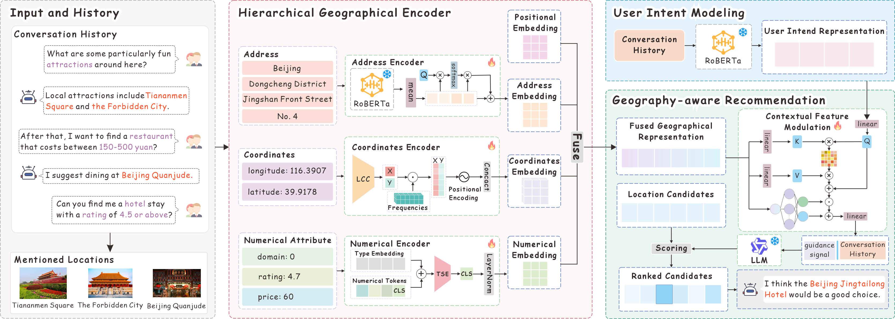

## From Dialogue to Destination: Geography-Aware Large Language Models with Multimodal Fusion for Conversational Recommendation

### 🖼️ Framework

-----

### ⚙️ Requirements
* **Python:** 3.10
* **PyTorch:** 2.6.0+cu118
* **HuggingFace Libraries:** `transformers`, `accelerate`

**Note:** Please ensure your system supports **CUDA 11.8** for full GPU acceleration with PyTorch.

-----

### 📂 Dataset

You can download the preprocessed dataset archive from the following link:
[Google Drive](https://drive.google.com/drive/folders/1UUb6z5dsvCam_3XAAm3JjombQQzBoVMI)

**Setup Steps:**

1. Download the dataset files from the link above.
2. Place the files into the data/$DATASET/processed directory within the project root.
-----

### 🚀 Quick Start Guide

#### Pre-requisites

1.  **Configure Accelerate:** Run the following command to set up the configuration file (`accelerate_config.yaml`) according to your GPU environment:

    ```bash
    accelerate config
    ```

2.  **Set Environment Variables:** Define the following variables before running the training scripts:

    ```bash
    PROJECT_DIR="./"           # Root directory of the project
    DATASET="your_dataset_name" # Dataset folder name
    EXP="your_experiment_name" # Experiment identifier
    GPT_MODEL="your_model_name_or_path"    # the LLM
    BERT_MODEL="your_model_name_or_path" # the Text Encoder
    ```

#### Training Steps

1.  **Stage 1: Pre-training**

    ```bash
    OUTPUT_DIR="$PROJECT_DIR/save/$DATASET/$EXP/train_pre"

    accelerate launch \
      --config_file "$PROJECT_DIR/accelerate_config.yaml" \
        train_pre.py \
      --dataset "$DATASET" \
      --tokenizer "$GPT_MODEL" \
      --model "$GPT_MODEL" \
      --text_tokenizer "$BERT_MODEL" \
      --text_encoder "$BERT_MODEL" \
      --num_train_epochs 3 \
      --gradient_accumulation_steps 1  \
      --per_device_train_batch_size 48 \
      --per_device_eval_batch_size 48 \
      --num_warmup_steps 1389 \
      --max_length 200 \
      --prompt_max_length 200 \
      --entity_max_length 32 \
      --learning_rate 3e-4 \
      --output_dir "$OUTPUT_DIR" \
      --num_workers 16 \
      --fp16
    ```

2.  **Stage 2: Train Recommendation**

    ```bash
    PROMPT_ENCODER_DIR="$PROJECT_DIR/save/$DATASET/$EXP/train_pre/best"
    OUTPUT_DIR="$PROJECT_DIR/save/$DATASET/$EXP/train_rec"

    accelerate launch \
      --config_file "$PROJECT_DIR/accelerate_config.yaml" \
        train_rec.py \
      --dataset "$DATASET" \
      --tokenizer "$GPT_MODEL" \
      --model "$GPT_MODEL" \
      --text_tokenizer "$BERT_MODEL" \
      --text_encoder "$BERT_MODEL" \
      --prompt_encoder "$PROMPT_ENCODER_DIR" \
      --num_train_epochs 5 \
      --per_device_train_batch_size 32 \
      --per_device_eval_batch_size 32 \
      --gradient_accumulation_steps 1 \
      --num_warmup_steps 500 \
      --context_max_length 200 \
      --prompt_max_length 200 \
      --entity_max_length 32 \
      --learning_rate 5e-4 \
      --output_dir "$OUTPUT_DIR" \
      --fp16
    ```
-----

### 🙏 Acknowledgement

We thank [UNICRS](https://github.com/wxl1999/UniCRS/tree/main) and [DCRS](https://github.com/huyquangdao/DCRS?tab=readme-ov-file) for providing the useful source code for the data preprocessing and prompt learning steps.

-----

### 📝 Citation

If you find this work useful for your research, please consider citing our paper.


-----

### 📜 License

This project is licensed under the **MIT License**.